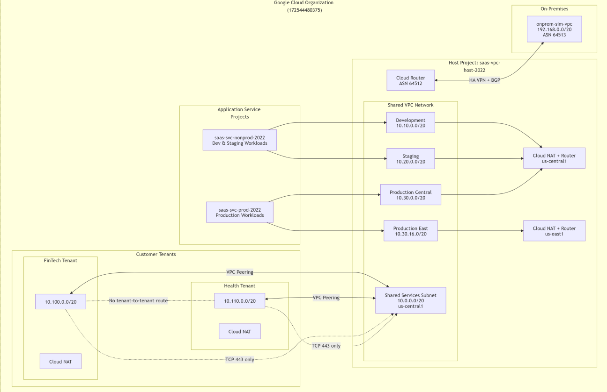
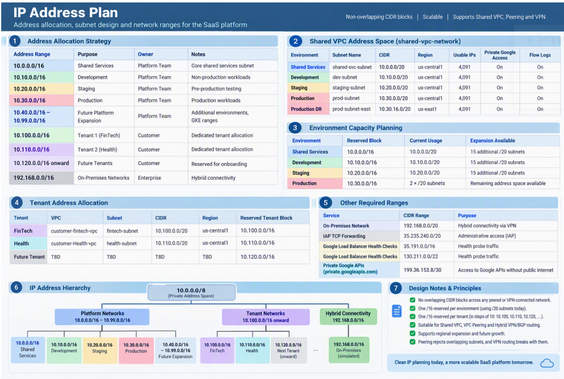
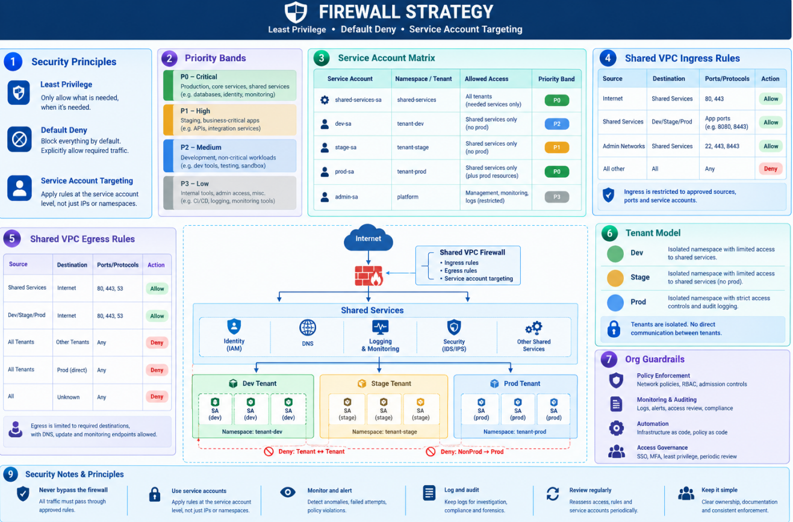

# Phase 2: Architecture Design

## Objective
Design a multi-tenant network that isolates fintech and healthcare tenants, centralises shared services in a Shared VPC, and applies zero-trust controls to every traffic path.

## Design Principles
- **Isolation by default:** each tenant has its own project and VPC, with no tenant-to-tenant path.
- **Explicit allow, logged deny:** every permitted flow names its source, target and port.
- **No public exposure:** no external IPs, admin access through IAP only, egress through Cloud NAT only.
- **Centralised control:** the host project owns subnets, firewall rules, routes and NAT.
- **Room to grow:** each environment and tenant reserves a /16 and uses a /20 today.

---

## 1. Topology

| Role | Project ID | Purpose |
|---|---|---|
| Organization | `172544480375` | Org policies, hierarchical firewall policy |
| Shared VPC host | `saas-vpc-host-2022` | `shared-vpc-network`, firewall, routes, NAT, routers |
| Service project | `saas-svc-prod-2022` | Production workloads |
| Service project | `saas-svc-nonprod-2022` | Staging and dev workloads |
| Tenant project | `saas-tenant-fintech-2022` | `customer-fintech-vpc`, peered to shared VPC |
| Tenant project | `saas-tenant-health-2022` | `customer-health-vpc`, peered to shared VPC |

**Why peer tenants instead of attaching them to the Shared VPC?** A service project shares the host network, so isolation would rely on firewall rules alone. A peered VPC per tenant gives a hard network boundary, its own firewall, NAT and flow logs, and one-step offboarding by deleting the peering.

---

## 2. IP Address Plan

| Network | Subnet | CIDR | Region |
|---|---|---|---|
| shared-vpc-network | `shared-svc-subnet` | 10.0.0.0/20 | us-central1 |
| shared-vpc-network | `dev-subnet` | 10.10.0.0/20 | us-central1 |
| shared-vpc-network | `staging-subnet` | 10.20.0.0/20 | us-central1 |
| shared-vpc-network | `prod-subnet` | 10.30.0.0/20 | us-central1 |
| shared-vpc-network | `prod-subnet-east` | 10.30.16.0/20 | us-east1 |
| customer-fintech-vpc | `fintech-subnet` | 10.100.0.0/20 | us-central1 |
| customer-health-vpc | `health-subnet` | 10.110.0.0/20 | us-central1 |
| onprem-sim-vpc | `onprem-subnet` | 192.168.0.0/20 | us-central1 |

- Platform ranges sit in `10.0`–`10.99`, and tenants get a /16 each from `10.100` up. The next tenant is `10.120.0.0/16`.
- No ranges overlap across peered or VPN-connected networks.
- All subnets have Private Google Access and VPC Flow Logs enabled.

---

## 3. Routing

| Route | Destination | Next hop | Purpose |
|---|---|---|---|
| Subnet routes | each subnet | VPC | Auto-created, exchanged over peering |
| `default-internet-egress` | 0.0.0.0/0 | Internet gateway | Required by Cloud NAT; gated by egress firewall |
| `private-google-apis` | 199.36.153.8/30 | Internet gateway | Google APIs without public IPs |
| BGP (dynamic) | 192.168.0.0/20 | HA VPN | Learned from on-prem via Cloud Router (ASN 64512 ↔ 64513) |

- The shared VPC uses **GLOBAL** dynamic routing, so routes learned in us-central1 reach us-east1.
- Peering does **not** export custom routes, so tenants never learn on-prem routes.
- Peering is non-transitive, so the two tenants have no route to each other.

---

## 4. Firewall Strategy

- **Default deny in both directions:** explicit deny-all rules at priority 65000 with logging on.
- **Targets are service accounts, not network tags:** changing a VM's service account requires IAM permission, while tags don't.
- **Priority bands:**

| Band | Use |
|---|---|
| 100–199 | Platform access (IAP, health checks) |
| 500–999 | Isolation denies (non-prod → prod, tenants → environments) |
| 1000–1999 | Environment application traffic |
| 2000–2999 | Tenant ↔ shared services (tcp:443 only) |
| 3000–3999 | On-prem traffic |
| 65000 | Deny-all (logged) |

- **Org-level guardrails:** a hierarchical firewall policy blocks SSH and RDP from the internet (except IAP `35.235.240.0/20`) and blocks traffic between tenant ranges in every VPC.

---

## 5. Peering Topology

| Peering | Between | Custom routes |
|---|---|---|
| `peer-shared-to-fintech` / `peer-fintech-to-shared` | shared ↔ fintech | Not exchanged |
| `peer-shared-to-health` / `peer-health-to-shared` | shared ↔ healthcare | Not exchanged |

- The design is hub-and-spoke: tenants peer only with the shared VPC.
- Firewall rules limit tenants to `shared-svc-subnet` on tcp:443.
- Each tenant runs its own Cloud NAT, because NAT doesn't serve peered networks.
- At the default limit of 25 peerings per VPC, the plan moves to Private Service Connect.

---

## 6. Security Requirements

| Area | Requirement |
|---|---|
| Isolation | No tenant-to-tenant path, enforced by non-transitive peering plus an org deny rule. Non-prod can't reach prod. |
| Access | No external IPs (`vmExternalIpAccess`), SSH via IAP with OS Login, peering limited to approved networks (`restrictVpcPeering`). |
| Identity | Terraform runs as `network-admin-sa` through impersonation, with no service account keys. |
| Encryption | TLS on all application traffic. Google APIs over Private Google Access. VPC Service Controls around the healthcare tenant. |
| Audit | Flow logs on every subnet, logging on all deny rules, admin audit logs, and export to Cloud Storage with 365-day retention. |

| Control | PCI DSS v4.0 | HIPAA |
|---|---|---|
| Tenant isolation, default deny | Req. 1 | §164.312(a) |
| IAP + OS Login, no external IPs | Req. 7–8 | §164.312(a), (d) |
| TLS, Private Google Access | Req. 4 | §164.312(e) |
| Flow, firewall and audit logs | Req. 10 | §164.312(b) |

---

## Notes & Issues
- **IP overlap in the course starter code:** `dev-subnet` and `customer-subnet-1` both used `10.10.0.0/20`. Peering rejects overlapping ranges, so tenants moved to `10.100.0.0/16` and above.
- **Peering can't filter routes per subnet:** restricting tenants to `shared-svc-subnet` is enforced with firewall rules on both sides.
- **Cost choices:** tenants and on-prem run in one region, and only prod spans two.